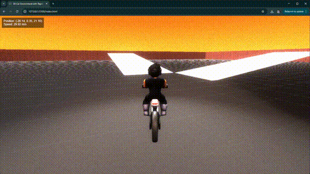

# road-rash-starter-pack
Starter pack for a three.js motorcycle game.

- Simple motorcycle game inspired by Road Rash 3D that uses Three.js and Rapier physics.
- Clone the repository and run the index.html with Live Server to test it out.
- Control the character direction with WASD.

**Blender file (moto_test.blend) included in the assets folder! If you are familiar with 3D software, you can retarget the rig to any character you want and add additional actions (animations).**

**If you get value from this repository follow me on X [@renderfiction](https://x.com/renderfiction)**

